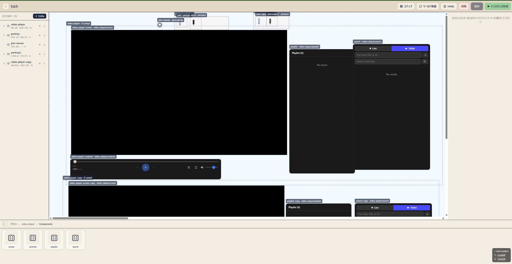

<p align="center">
  
</p>

<h1 align="center">Ubichill</h1>

<p align="center">
  <strong>みんなのカーソルが集まって、描いたり、観たり、いっしょに過ごす Web スペース。</strong><br />
  URL を開くだけ。インストール不要、機能を誰でもurlで追加できる
</p>

<p align="center">
  <a href="https://ubichill.com/"><strong>ubichill.com</strong></a>（紹介）
  ・
  <a href="https://app.ubichill.com/"><strong>アプリを開く</strong></a>
</p>

<p align="center">
  <a href="docs/ARCHITECTURE.md">Architecture</a>
  ・
  <a href="docs/WORLD_AS_CODE.md">World as Code</a>
  ・
  <a href="docs/API.md">API</a>
  ・
  <a href="docs/ROADMAP.md">Roadmap</a>
</p>

---

## Ubichill とは

URL を開くだけでカーソルがアバターになる、軽量な 2D メタバース。
ペン・動画・付箋など、ワールドの機能は **動的にロードされる Web Worker プラグイン** で増やせる。

- **動的にロードされるプラグイン** — ゼロトラスト Worker サンドボックスで安全に実行
- **完全 CSR + Socket.IO** — サーバーは状態同期だけ、UI はブラウザに閉じる
- **World as Code** — YAML でワールド定義をプロビジョニング、エディタで編集

## 環境

| 用途 | URL | 反映トリガー |
|---|---|---|
| ホーム（紹介サイト） | <https://ubichill.com/> | 別途（アプリ本体とは分離） |
| Production（アプリ本体） | <https://app.ubichill.com/> | `main` への merge → `:latest` / `:sha-<sha>` イメージで自動デプロイ |
| PR プレビュー | `pr-<番号>.ubichill.com` | PR に `preview` ラベル付与 → `:pr-<番号>` / `:sha-<sha>` をビルドし、GitOps（ArgoCD ApplicationSet）が PR ごとに払い出す |

> イメージは GHCR（`ghcr.io/<owner>/ubichill-{backend,frontend}`）に push される。デプロイ先のドメインや secret は本リポジトリには含めず、GitOps/Helm values 側で注入する（`global.domain` や `MAIL_FROM` 等）。

## 自分のサーバーで動かす

```bash
helm repo add ubichill https://ubichill.github.io/ubichill
helm install ubichill ubichill/ubichill -n ubichill --create-namespace \
  --set global.domain=<your-domain> \
  --set backend.secretEnv.BETTER_AUTH_SECRET=<random-secret>
```

`global.domain` から Ingress ホスト / `CORS_ORIGIN` / `BETTER_AUTH_URL` が導出される。
DB は同梱の PostgreSQL がパスワードを自動生成するので指定不要（自前 DB を使うなら
`postgresql.auth.password` か `postgresql.auth.existingSecret` を指定）。メール認証を使うなら
`backend.secretEnv.RESEND_API_KEY` と `backend.env.MAIL_FROM`、使わないなら
`backend.env.SKIP_EMAIL_VERIFICATION=true` を設定する。

詳細は [Helm Chart README](charts/ubichill/README.md) と [Troubleshooting](docs/Troubleshooting.md)。

## ローカル開発

```bash
pnpm install
pnpm dev          # PostgreSQL (Docker) + Backend (3001) + Frontend (3000)
```

PR フローは [.github/workflows/ci.yml](.github/workflows/ci.yml)、内部設計は [docs/ARCHITECTURE.md](docs/ARCHITECTURE.md)。

## コントリビュート

Issue / PR 歓迎。公式プラグインだけ作る、もウェルカム。
PR は日本語でできればお願いします。

## ライセンス

TBD
