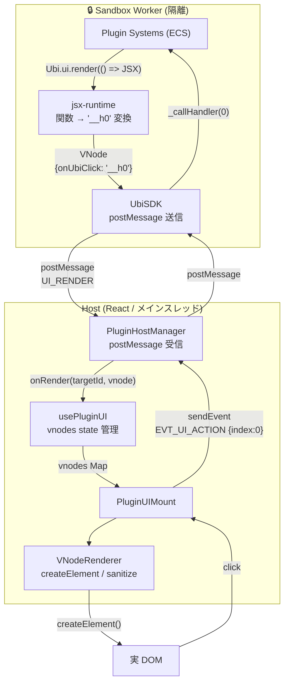
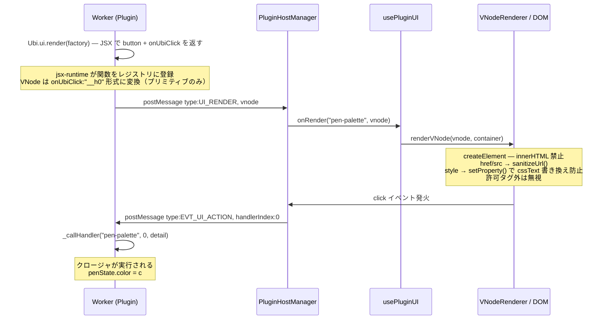
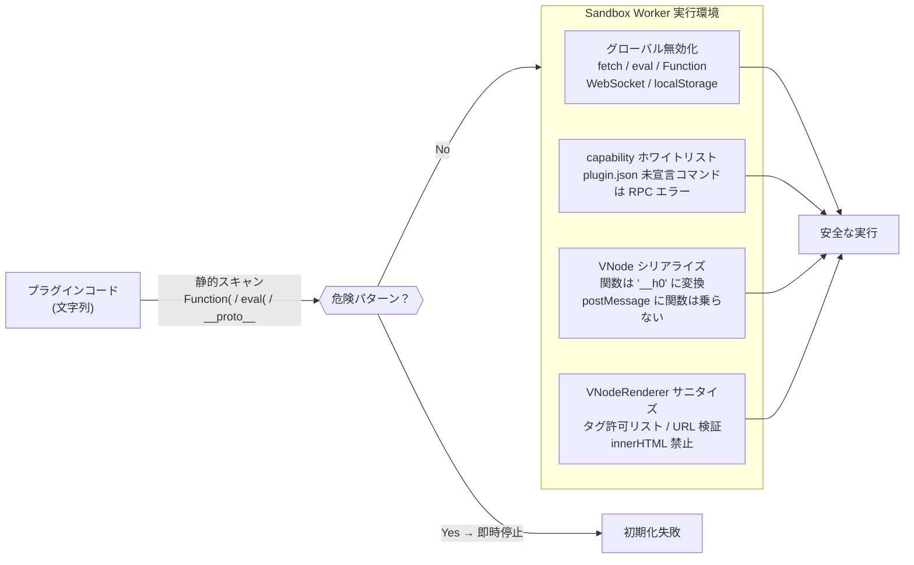

# Ubichill

URLで起動しSocket.IOでカーソルがアバターのように同期する、ゼロトラスト型プラグイン動的ロード 2D メタバース基盤。
Vite ベースの完全 CSR、pnpm workspace モノリポ。

## クイックスタート

```bash
pnpm install
pnpm dev            # PostgreSQL (Docker) + Backend (3001) + Frontend (3000) を一括起動
pnpm build:workers  # plugins/*/worker を esbuild でバンドル
pnpm lint:fix       # Biome フォーマット
pnpm typecheck      # tsgo --noEmit
```

## PR を出すと何が起きるか

`main` 向けに PR を開くと [`.github/workflows/ci.yml`](.github/workflows/ci.yml) が次を自動で走らせる:

1. **Lint** (Biome) → **変更検知** (`packages/backend` / `packages/frontend` / `plugins/video-player/backend`)
2. **Docker イメージビルド** — 差分があったものだけ `ghcr.io/<owner>/ubichill-*:dev-<sha>` で push
3. **`dev` ブランチへ force push** → ArgoCD が拾って K8s に反映
4. **PR に bot コメント** — Dev 環境 URL: <https://ubichill-dev.youkan.uk/>

数分後にブラウザで動作確認可能。画面右下のバッジで現在の commit hash が確認できる。
`main` への merge で `latest` タグ + 次バージョンの git tag (`vX.Y.Z+1`) が打たれ prod 反映。

---

## パッケージ構成

| パッケージ | 役割 | 実行環境 |
|---|---|---|
| `@ubichill/shared` | 型・定数・Zod スキーマ | 全環境 |
| `@ubichill/db` | Drizzle ORM スキーマ・リポジトリ | Backend |
| `@ubichill/backend` | Express 5 + Socket.IO サーバー | Node |
| `@ubichill/engine` | 純粋 ECS エンジン (React / DOM / Network 依存ゼロ) | Worker / Host |
| `@ubichill/sandbox` | Worker 隔離実行環境・VNodeRenderer | Host / Worker |
| `@ubichill/react` | React Hooks (`usePluginWorker`, `usePluginUI`) | Host |
| `@ubichill/sdk` | プラグイン開発者向け公開 API (`Ubi.*`) | Worker のみ |
| `@ubichill/frontend` | Vite + React 19 SPA (Host 本体) | Browser |

## 技術スタック

- **言語/型:** TypeScript 7 (native preview), Zod
- **フロント:** Vite, React 19, React Router v7, Panda CSS, Socket.IO Client
- **バック:** Express 5, Socket.IO, Drizzle ORM, PostgreSQL, Better Auth, Resend
- **モノリポ:** pnpm workspace, Turborepo
- **静的解析:** Biome
- **配信:** Docker, Kubernetes, Helm, ArgoCD

---

## プラグイン UI アーキテクチャ

### 設計の大原則：Worker 内 JS がメインスレッドに触れない

プラグインの UI ロジックは **Web Worker** の中で完結する。
Worker は DOM に直接アクセスできないため、Host への指示は `postMessage` 経由のシリアライズ可能なデータ（VNode）のみ。



### TSX → VNode → postMessage → DOM の変換フロー



### セキュリティの多層防御



### パフォーマンス設計

| 対象 | 手法 | 効果 |
|---|---|---|
| mousemove | `InputCollector` がフレーム内で最終位置 1 件に上書きデデュプ | 100 件来ても Worker 送信は O(1) |
| Canvas | permanent + active の 2 レイヤー | 確定ストロークが増えても再描画しない |
| UI 再描画 | VNode 参照が同一なら DOM 再構築をスキップ | 毎 Tick render() しても DOM 不変なら何もしない |
| カーソル移動 | `divRef.current.style` 直接書き換え | React re-render 0 回 |
| Worker バンドル | `sideEffects:false` + Fragment インライン定義 | バンドルを小さく保つ |

---

## デプロイ

```bash
helm repo add ubichill https://ubichill.github.io/ubichill
helm install ubichill ubichill/ubichill --namespace ubichill --create-namespace
```

ArgoCD GitOps 対応。`charts/` に Helm チャート、`worlds/` に World as Code の YAML 定義。
