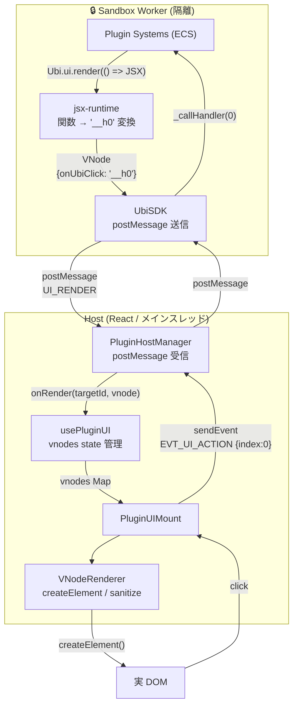
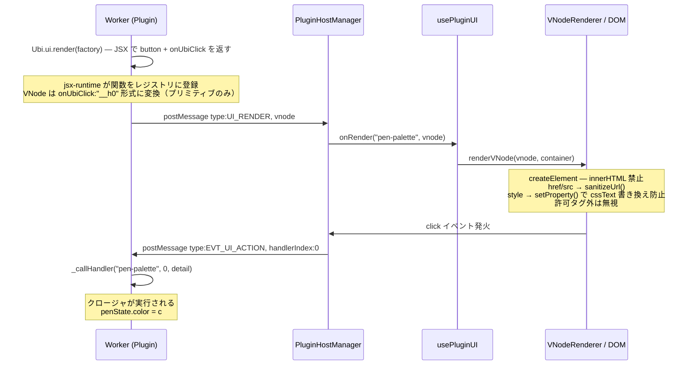
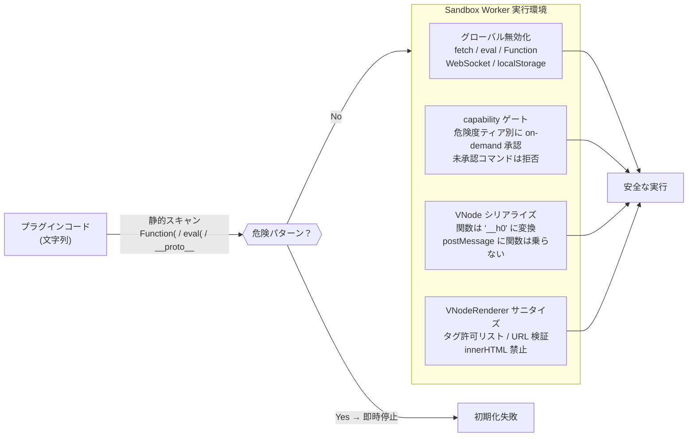

# Ubichill アーキテクチャ

## システム全体像

```
Browser (Main Thread)
  └─ React Host
       └─ PluginHostManager          packages/sandbox
            │  postMessage
            ▼
       Sandbox Worker (Guest)         packages/sandbox
            └─ UbiSDK (Ubi)          packages/sdk
                 ├─ Ubi.state         entity.data と双方向同期する宣言的ストア
                 ├─ Ubi.entity        callable: self / of(id) + query / get / spawn
                 ├─ Ubi.event         sendToHost / broadcast / emit (クロス Worker)
                 ├─ Ubi.ui / .media / .canvas / .player
                 └─ Ubi.fetch / .registerSystem / .log
```

ロジックはすべて **Sandbox Worker** 内で処理し、React はレンダリングのみを担う。
Socket.IO によるワールド同期はメインスレッドが担い、Worker は知らない。

### SDK 名前空間（プラグイン開発者向け）

| 名前空間 | 特性 | 用途 |
|---|---|---|
| `Ubi.state.*` | 宣言的・自動同期 | `state.local.x = v` で entity.data と双方向同期 (`sync` の options で挙動切替) |
| `Ubi.entity()` / `Ubi.entity(id)` | callable | self/other へ `.update / .destroy / .spawn` のハンドルを返す |
| `Ubi.entity.query / get / spawn` | 静的メソッド | type 検索 / id 取得 / 自由 spawn |
| `Ubi.event.*` | トリガー | `sendToHost` / `broadcast` (他ユーザー揮発) / `emit` (同 tab クロス Worker) |
| `Ubi.ui.*` | Fire & Forget | UI 描画 (`render`) / トースト |
| `Ubi.media.*` | Fire & Forget | video / HLS 再生制御 |
| `Ubi.canvas.*` | Fire & Forget | canvas 描画 |
| `Ubi.player.*` | プレイヤー | `others()` / `all()` / `syncCursor()` |
| `Ubi.fetch` / `.registerSystem` / `.log` | shortcut | HTTP / System 登録 / ログ |

ECS 用語と命名規約の詳細は [`design/ecs-migration.md`](./design/ecs-migration.md) を参照。
Entity == GameObject、Worker 1 つ = Component インスタンス 1 つ。

---

## パッケージ責務

| パッケージ | 責務 | 依存禁止 |
|---|---|---|
| `@ubichill/engine` | 純粋 ECS（Entity / Component / System / Query） | React・DOM・Worker・Network |
| `@ubichill/sandbox` | Worker ライフサイクル・Tick ループ・入力収集 | React |
| `@ubichill/react` | React Hooks 群（usePluginWorker / useEntity 等） | — |
| `@ubichill/sdk` | プラグイン開発者向け公開 API（Ubi） | `@ubichill/shared` などの内部パッケージ |
| `@ubichill/shared` | 型定義・プロトコル定義 | — |
| `plugins/*` | 各プラグイン実装 | `@ubichill/sdk` のみ |

---

## プラグイン実行モデル（ECS）

Worker 内では `Ubi`（UbiSDK インスタンス）が自動注入される。
プラグインは ECS System として実装し、毎フレーム `entities` / `deltaTime` / `events` を受け取る。

- **Entity**: 識別子を持つオブジェクト（ローカル）
- **Component**: Entity に付与するデータの断片（型付き）
- **System**: 毎フレーム全 Entity を走査して処理を行う関数
- **Query**: 特定 Component を持つ Entity を絞り込むキャッシュ付きフィルタ

ECS は `@ubichill/engine` で完結し、ネットワーク・DOM を一切知らない。

---

## Host ↔ Guest 通信プロトコル

### Guest → Host（PluginGuestCommand）

| type | 分類 | 説明 |
|---|---|---|
| `CMD_READY` | Fire & Forget | Worker 初期化完了通知 |
| `SCENE_GET_ENTITY` | RPC | エンティティ取得 (`Ubi.entity.get`) |
| `SCENE_QUERY_ENTITIES` | RPC | type 検索 (`Ubi.entity.query`) |
| `SCENE_CREATE_ENTITY` | RPC | 新規 spawn (`Ubi.entity().spawn` / `Ubi.entity.spawn`) |
| `SCENE_UPDATE_ENTITY` | RPC | エンティティ更新 (`Ubi.entity().update` / `Ubi.entity(id).update` / `state.sync` flush) |
| `SCENE_DESTROY_ENTITY` | RPC | エンティティ削除 (`Ubi.entity().destroy` / `Ubi.entity(id).destroy`) |
| `NETWORK_SEND_TO_HOST` | Fire & Forget | 自 Host にメッセージ (`Ubi.event.sendToHost`) |
| `NETWORK_BROADCAST` | Fire & Forget | 全ユーザーの同 entity Worker に揮発性配信 (`Ubi.event.broadcast` / `state.sync` の ephemeral) |
| `EVENT_EMIT` | Fire & Forget | 同 tab 内の他 Worker (scope + targetType) にイベント (`Ubi.event.emit`) |
| `UI_RENDER` | Fire & Forget | VNode を Host に送って DOM 化 (`Ubi.ui.render`) |
| `UI_SHOW_TOAST` | Fire & Forget | トースト (`Ubi.ui.showToast`) |
| `CANVAS_FRAME` / `CANVAS_COMMIT_STROKE` | Fire & Forget | canvas 描画 (`Ubi.canvas.*`) |
| `MEDIA_*` | Fire & Forget | video 制御 (`Ubi.media.*`) |
| `NET_FETCH` | RPC | HTTP リクエスト (`Ubi.fetch`) |
| `CMD_LOG` | Fire & Forget | ログ (`Ubi.log`) |

**RPC** は `id` フィールドを持ち、Host が `EVT_RPC_RESPONSE` で応答する（タイムアウト 10s）。

### Host → Guest（PluginHostEvent）

| type | 説明 |
|---|---|
| `EVT_LIFECYCLE_INIT` | 初期化（code / worldId / myUserId） |
| `EVT_LIFECYCLE_TICK` | フレーム更新（deltaTime ms） |
| `EVT_INPUT` | 入力イベントバッチ（MOUSE_MOVE / MOUSE_DOWN / KEY_DOWN 等） |
| `EVT_PLAYER_JOINED` | ユーザー入室 |
| `EVT_PLAYER_LEFT` | ユーザー退室 |
| `EVT_PLAYER_CURSOR_MOVED` | 他ユーザーのカーソル移動 |
| `EVT_SCENE_ENTITY_UPDATED` | 購読中エンティティ更新 |
| `EVT_NETWORK_BROADCAST` | 他ユーザーからのブロードキャスト受信 |
| `EVT_RPC_RESPONSE` | RPC 応答 |
| `EVT_CUSTOM` | プラグイン独自イベント（Host → Worker） |

### 初期化シーケンスの注意点

`EVT_LIFECYCLE_INIT` は **キューを通さず** Worker へ直接 postMessage する。
キュー経由にすると `CMD_READY` が返ってこないまま Tick がキューに積まれ deadlock になる。

`CMD_READY` 受信後にキューをフラッシュする。`CMD_READY` が届かない = 初期化失敗。

### Capability ゲート（権限）

Worker→Host の各コマンドは、Host 側の単一ゲート (`createCapabilityGate`) を通る。capability は
使用 API からビルド時に自動生成され（宣言不要・情報表示用）、実際の許可は**危険度ティア別に
実行時ユーザー承認**する（on-demand）。safe は常に許可、sensitive は既定許可、dangerous は承認必須。
fetch は接続先ドメインごとに承認する。詳細は [`API.md`](./API.md) の「権限 (Capability)」節。

---

## リアルタイム同期（UEP）

同期には 2 つのチャネルがある。

| チャネル | 用途 | 保存 | 頻度 |
|---|---|---|---|
| **Reliable State** | 位置確定・色変更・ロック | PostgreSQL | 低（1-10Hz / アクション終了時） |
| **Volatile Stream** | ドラッグ中・カーソル・描画軌跡 | なし（ブロードキャストのみ） | 高（30-60Hz） |

`stream` は 30ms（33Hz）を目安にスロットリングする。

### 楽観的ロック（Lock → Mutate → Release）

1. ユーザーがオブジェクトに触れる → フロントで即座に `lockedBy: me` と仮定（レイテンシ隠蔽）
2. 操作中は `stream` チャネルで座標・軌跡を配信
3. 操作終了時に確定データを `PATCH`・`lockedBy: null` でロック解除

切断時はサーバーが全 `lockedBy` を強制 `null` にリセット（デッドロック防止）。

---

## Sandbox セキュリティ

5 層構造でプラグインコードを隔離する。

1. **グローバル無効化** — `fetch` / `WebSocket` / `eval` / `Function` / `importScripts` を `undefined` に書き換え
2. **プロトタイプ凍結** — `Object.prototype` 等をフリーズしてプロトタイプチェーン汚染をブロック
3. **postMessage 直接呼び出し禁止** — `self.postMessage` を警告のみの関数に差し替え（内部の `securePostMessage` のみが実際に送信）
4. **危険パターン検出** — `importScripts` / `eval(` / `Function(` / `__proto__` / `prototype[` を正規表現でチェック
5. **SafeFunction 評価** — `"use strict"` + try/catch ラップで実行（`SafeFunction` は `nullifyGlobals()` 前に保存した唯一の `Function` 参照）

**既知の限界**: `new Function()` ベースのため完全な VM 隔離ではない。
将来の改善候補: QuickJS + WASM による完全隔離（コスト高のため未実装）。

---

## パフォーマンス設計

詳細は `CLAUDE.md` のパフォーマンス設計セクションを参照。

| 最適化 | 場所 | 効果 |
|---|---|---|
| InputCollector MOUSE_MOVE デデュプ | `packages/sandbox` | フレームあたり mousemove を 1 件に集約（O(1)） |
| rAF バインドレス arrow field | `packages/sandbox` | 毎フレームの `bind()` アロケーション排除 |
| ECS エンティティ配列 dirty flag キャッシュ | `packages/engine` | エンティティ変化なし時の tick を O(1) に |
| useCursorPosition DOM 直接書き込み | `packages/react` | カーソル 60fps 更新で React re-render ゼロ |
| useEntity shallow equality | `packages/react` | `JSON.stringify` 比較を O(k) に置き換え |

---

## UI レンダリングの内部フロー (図解)

### 大原則: Worker 内 JS はメインスレッドに触れない

プラグインの UI ロジックは **Web Worker** の中で完結する。
Worker は DOM に直接アクセスできないため、Host への指示は `postMessage` 経由のシリアライズ可能なデータ（VNode）のみ。



### TSX → VNode → postMessage → DOM の変換シーケンス



### セキュリティの多層防御


