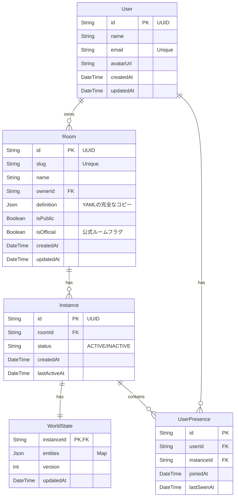

# Database Schema Design (Detailed)

## 概要
PostgreSQL + Prisma を使用した詳細設計です。

## 1. ER図 (Mermaid)



## 2. Prisma Schema (Draft)

Prismaのスキーマ定義言語（SDL）を使用した実装レベルの設計です。
ここでインデックス（`@@index`）やユニーク制約（`@unique`）、リレーション（`@relation`）を定義します。

**インデックスについて**:
Prismaでは `@@index` を記述することで、マイグレーション生成時にDBへのインデックス作成SQLが自動生成されます。
自動で勝手に作られるわけではなく、**開発者が意図を持って設計する必要**があります。

```ts
// schema.prisma

generator client {
  provider = "prisma-client-js"
}

datasource db {
  provider = "postgresql"
  url      = env("DATABASE_URL")
}

model User {
  id        String   @id @default(uuid()) // UUID v4
  name      String
  email     String?  @unique // ログイン用。ユニークインデックスが作成される
  avatarUrl String?  @map("avatar_url")
  
  createdAt DateTime @default(now()) @map("created_at")
  updatedAt DateTime @updatedAt @map("updated_at")

  // Relations
  ownedRooms Room[]
  presences  UserPresence[]

  @@map("users") // テーブル名は複数形・小文字
}

model Room {
  id          String   @id @default(uuid())
  slug        String   @unique // URL用識別子。例: "workspace-a"
  name        String
  description String?
  thumbnail   String?
  ownerId     String?  @map("owner_id")
  
  // 正規化された設定フィールド (検索・フィルタリング用)
  capacityMax Int      @default(20) @map("capacity_max")
  isPublic    Boolean  @default(true) @map("is_public")
  isOfficial  Boolean  @default(false) @map("is_official")
  
  // その他の複雑な設定や将来の拡張フィールドはJSONに残す
  // (例: permissions, dependencies, initialEntities)
  definition  Json     

  createdAt   DateTime @default(now()) @map("created_at")
  updatedAt   DateTime @updatedAt @map("updated_at")

  // Relations
  owner     User?      @relation(fields: [ownerId], references: [id])
  instances Instance[]

  // Indexes
  @@index([ownerId]) 
  @@index([isPublic, isOfficial])
  // キャパシティでの検索などが可能に
  @@index([capacityMax])

  @@map("rooms")
}

enum InstanceStatus {
  ACTIVE
  INACTIVE
  ARCHIVED
}

model Instance {
  id           String         @id @default(uuid())
  roomId       String         @map("room_id")
  status       InstanceStatus @default(ACTIVE)
  
  createdAt    DateTime       @default(now()) @map("created_at")
  lastActiveAt DateTime       @default(now()) @map("last_active_at")

  // Relations
  room       Room          @relation(fields: [roomId], references: [id])
  worldState WorldState?
  presences  UserPresence[]

  // Indexes
  // ルームに紐づくアクティブなインスタンス一覧取得の高速化
  @@index([roomId, status])
  
  // 古いインスタンスの掃除（GC）用
  @@index([lastActiveAt])

  @@map("instances")
}

model WorldState {
  instanceId String   @id @map("instance_id") // Instance IDと同じにする（1:1関係）
  
  // エンティティの塊。
  // 頻繁な書き込みがあるため、個別のEntityテーブルに分解すると
  // 書き込みコストが爆発するためJSONBで一括保存を選択。
  entities   Json
  
  version    Int      @default(1)
  updatedAt  DateTime @updatedAt @map("updated_at")

  // Relations
  instance   Instance @relation(fields: [instanceId], references: [id], onDelete: Cascade)

  @@map("world_states")
}

// 誰がどこにいるかを管理（Redis等でも良いが永続化のためDBに）
model UserPresence {
  id         String   @id @default(uuid())
  userId     String   @map("user_id")
  instanceId String   @map("instance_id")
  
  joinedAt   DateTime @default(now()) @map("joined_at")
  lastSeenAt DateTime @default(now()) @map("last_seen_at")

  // Relations
  user     User     @relation(fields: [userId], references: [id])
  instance Instance @relation(fields: [instanceId], references: [id], onDelete: Cascade)

  // Indexes
  // 特定ユーザーが今どこにいるかを探す
  @@index([userId, lastSeenAt])
  // インスタンス内のユーザー一覧
  @@index([instanceId])

  @@map("user_presences")
}
```

## 3. 詳細解説

### Q. インデックスはORMがやってくれる？
**A. いいえ、設計者が定義します。**
ORM (Prisma) は `@@index` という定義を見て、「DBにインデックスを作成する命令 (SQL)」を発行してくれますが、「どこにインデックスを貼るべきか」は自動判断しません。

**インデックス戦略の基本:**
1.  **検索条件 (`WHERE`) に使うカラム**: `slug`, `email`, `status` など
2.  **並び替え (`ORDER BY`) に使うカラム**: `createdAt`, `updatedAt` など
3.  **外部キー (`Foreign Key`)**: `roomId`, `ownerId` など（Join時のパフォーマンス向上）
4.  **カーディナリティ（値の種類の多さ）**: 種類の少ないカラム（例: `isPublic` 単体）にインデックスを貼ってもあまり効果がありません。複合インデックス (`[isPublic, createdAt]`) にすると、「公開されているものを新しい順に」取得する際に高速になります。

### Q. リレーションはどうする？
**Prismaでのリレーションの考え方:**

1.  **1対多 (1:N)**:
    - User (1) : Room (N) -> 1人のユーザーは複数のルームを持てる
    - Room (1) : Instance (N) -> 1つのルーム定義から複数のインスタンスが生まれる
    - `fields: [ownerId], references: [id]` のように外部キーを明示します。

2.  **1対1 (1:1)**:
    - Instance (1) : WorldState (1)
    - インスタンスとスナップショットは不可分なので、同じID (`instanceId`) をPKとして共有し、1:1リレーションとして定義しています。
    - `onDelete: Cascade` により、インスタンスが削除されたらワールド状態も自動削除されます。

### JSONB vs 正規化テーブル
今回の設計での最大のポイントは `WorldState.entities` を **JSONB** にしている点です。

-   **メリット**:
    -   書き込みが非常に高速（1回のUPDATEで済む）。
    -   スキーマレス（エンティティの構造が変わってもDBマイグレーション不要）。
    -   `worldState.ts` (Map) の内容をそのままシリアライズできる。
-   **デメリット**:
    -   SQLでの複雑な検索（例: 「特定の座標にあるエンティティを探す」）が遅い/難しい。
-   **結論**:
    -   ゲームやリアルタイムアプリの状態保存（スナップショット）としてはJSONBが適しています。検索要件が出たら、別途検索用テーブルを作るか、Elasticsearch等を検討します。

RoomとUserテーブルは正規化テーブルにする

## 4. Redis Architecture (Real-time Sync)

DBによる永続化とは別に、リアルタイム同期や一時的な状態管理には **Redis** を使用します。

### 用途
1.  **Pub/Sub (Real-time Messaging)**:
    -   ユーザーの操作（移動、チャット、オブジェクト操作）を各インスタンスにブロードキャストします。
    -   Socket.io の Adapter として `socket.io-redis-adapter` (または `socket.io-redis`) を使用し、マルチサーバー構成でのイベント同期を実現します。

2.  **User Presence (Ephemeral State)**:
    -   「誰がどのルームにいるか」や「最終アクティブ時間」などの揮発性の高い情報はRedisで管理します。
    -   DBの `UserPresence` テーブルは、Redisの情報を定期的に（または退室時に）ダンプして永続化するためのバックアップとして機能します。

3.  **Locking (Distributed Lock)**:
    -   ワールド状態の書き込み競合を防ぐための分散ロック（Redlock等）に使用する可能性があります。

### Redis Data Structure (Example)

| Key Type | Key Pattern | Value | TTL | Description |
|----------|-------------|-------|-----|-------------|
| String | `room:{slug}:instance` | `{instanceId}` | - | ルームSlugとアクティブなインスタンスIDのマッピング |
| Hash | `instance:{id}:users` | `{userId}: {userData}` | Yes | インスタンス内のユーザー一覧（リアルタイム） |
| PubSub | `socket.io:events` | - | - | Socket.ioのイベントバス |
