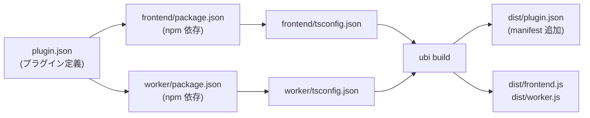

# Ubicrate CLI 計画書

## 概要

**Ubicrate**（略：Ubi）は、Ubichill プラグイン開発・デプロイを簡素化するコマンドラインツールです。

```bash
$ ubi create my-plugin     # 新規プラグイン作成
$ ubi build               # プラグインをコンパイル・バンドル
$ ubi deploy              # プラグインをマーケットプレイスへアップロード
```

---

## 実装段階

### **Phase 1: 現在（標準化）**

このブランチで実施：

- ✅ **プラグイン統一規約** → `plugin.json` スキーマ定義
- ✅ **ディレクトリ構造の標準化** → `frontend/` + `worker/` の分離
- ✅ **TypeScript の型安全化** → Worker 通信型の定義
- ✅ **メッセージング型システム** → `PluginMessagingSchema`

**成果物:**
- `packages/sdk/plugin.config.schema.json` — 設定スキーマ
- `packages/engine/src/messaging-types.ts` — 型定義
- `docs/PLUGIN_DEVELOPMENT.md` — 新規約ガイド
- `plugins/pen/plugin.json` + `plugins/pen/worker/` — 実装例

---

### **Phase 2: ビルド・バンドリング**

✅ **完了** — `scripts/build-workers.mjs` として実装済み（esbuild使用）

```bash
$ ubi build
# → node scripts/build-workers.mjs && turbo build
```

**実装内容：**

1. **Worker コードのバンドル**
   - `worker/src/index.ts` を esbuild でコンパイル
   - 出力: `PenBehaviour.gen.ts` (TypeScript string export)
   - Tree-shaking により SDK のみを Bundle に含める

2. **Frontend のバンドル**
   - `frontend/src/index.ts` を vite でコンパイル
   - 型定義 (`.d.ts`) を生成

3. **メタデータ自動生成**
   - `plugin.json` からビルド時刻・チェックサムを追加
   - `manifest` フィールドに記録

**期待される構造:**

```
plugins/my-plugin/
├── plugin.json
├── frontend/
│   ├── src/
│   ├── dist/                   # npm package 用
│   │   ├── index.d.ts
│   │   ├── index.js
│   │   └── index.mjs
│   └── ...
│
├── worker/
│   ├── src/
│   ├── dist/
│   │   ├── worker.js           # 実行可能なWorkerコード
│   │   └── worker.d.ts         # 型定義
│   └── ...
│
└── dist/                       # ★最終成果物（デプロイ用）
    ├── plugin.json
    ├── frontend.min.js
    └── worker.min.js
```

---

### **Phase 3: プラグイン作成テンプレート**

```bash
$ ubi create my-plugin --template widget
```

**テンプレート生成:**
- 完全なディレクトリ構造
- `package.json` + `tsconfig.json`
- サンプル実装（`src/index.ts`, `types.ts` など）
- GitHub Actions CI/CD テンプレート

---

### **Phase 4: ホットリロード & デバッグ**

```bash
$ ubi dev
```

**機能:**
- Worker コード変更で自動再読み込み
- Frontend 変更で HMR
- ブラウザ DevTools で Worker スクリプトをデバッグ可能にする
- Console logs をそのまま表示

---

### **Phase 5: プラグインマーケットプレイス**

```bash
$ ubi publish [--registry npm]
```

**機能:**
- npm registry へ自動パブリッシュ
- バージョン管理・依存解決
- プラグイン検索 & インストール

**package.json:**
```json
{
  "name": "@ubichill-plugins/my-plugin",
  "main": "./dist/index.js"
}
```

---

## 実装ロードマップ

| Phase | Task | Priority | Effort | Timeline |
| :--- | :--- | :--- | :--- | :--- |
| 1 | 規約・スキーマ定義 | ⭐⭐⭐ | 小 | ✅ 完了 |
| 2 | esbuild/Vite 統合 | ⭐⭐ | 中 | ✅ 完了 |
| 3 | Template Generator | ⭐⭐ | 小 | 1 週間 |
| 4 | Hot Reload | ⭐ | 大 | 2-3 週間 |
| 5 | Marketplace | ⭐ | 大 | 1ヶ月+ |
| 6 | WASM Support | ⭐ | 大 | 2ヶ月+ |

---

## ファイルの役割

### CLI リポジトリ構造（将来）

```
packages/cli/                    # Ubicrate CLI パッケージ
├── bin/
│   └── ubi.ts                  # エントリーポイント
├── src/
│   ├── commands/
│   │   ├── create.ts           # ubi create
│   │   ├── build.ts            # ubi build
│   │   ├── dev.ts              # ubi dev
│   │   └── publish.ts          # ubi publish
│   ├── bundler/
│   │   ├── bundle-worker.ts    # Worker esbuild
│   │   ├── bundle-frontend.ts  # Frontend Vite
│   │   └── minify.ts           # JS/CSS 圧縮
│   ├── schema/
│   │   ├── plugin-config.ts    # plugin.json パーサ
│   │   └── plugin-manifest.ts  # manifest スキーマ
│   └── utils/
│       ├── validate.ts
│       └── fs-helpers.ts
└── templates/                  # プラグイン雛形
    ├── widget/
    └── app/
```

---

## 設定ファイルの連鎖



---

## 開発者体験の向上

### Before（現状）
```tsx
// Worker コード = 文字列 → IDE 補完なし
const penPluginCode = `
class PenBehaviour extends UbiBehaviour {
    onCustomEvent(eventType, data) {
        // ← eventType, data の型がわからない
        Ubi.messaging.send('...', {...});
    }
}
`;
```

### After（目標）
```tsx
// Worker コード = TypeScript + 型安全
import type { PenWorkerMessage, PenHostMessage } from './worker/src';

// IDE 補完: sendEvent({type: 'EVT_CUSTOM', payload: ...}) で推奨候補が出る
// 型チェック: 間違った payload を送ると compile error
```

---

## チェックリスト

### Phase 1: 規約化（現在 ✅）
- [x] `plugin.json` スキーマ JSON Schema 形式で定義
- [x] ディレクトリ構造の統一（frontend + worker）
- [x] メッセージング型システムの導入
- [x] Pen プラグインの実装例を更新
- [x] PLUGIN_DEVELOPMENT.md を新規約で改訂

### Phase 2: ビルド
- [ ] esbuild 設定作成（ CLI 側）
- [ ] Vite 設定確認（CLI 側）
- [ ] Worker JS バンドルのテスト
- [ ] チェックサム生成ロジック
- [ ] CI/CD パイプライン追加

### Phase 3-5: 拡張機能
- [ ] Template 生成コマンド
- [ ] ホットリロード
- [ ] マーケットプレイス統合

---

## 参考資料

- [プラグイン設定スキーマ](../packages/sdk/plugin.config.schema.json)
- [新・プラグイン開発ガイド](./PLUGIN_DEVELOPMENT.md)
- [型安全メッセージング](../packages/engine/src/messaging-types.ts)
- [Pen プラグイン実装例](../plugins/pen/)
