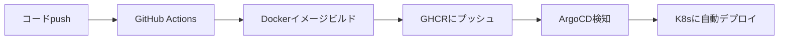

# ArgoCD + GitHub Actions GitOps Workflow

このディレクトリには、ArgoCDでvideo-playerプラグインをデプロイするための設定が含まれています。

## 🔄 GitOpsワークフロー



### 1. コード変更をpush
```bash
git push origin main
```

### 2. GitHub Actionsが自動実行
- テスト実行
- Dockerイメージビルド
- GitHub Container Registryにプッシュ

### 3. ArgoCDが自動デプロイ
- Gitリポジトリを監視
- 新しいイメージタグを検知
- Kubernetesに自動適用

## 📦 ArgoCDセットアップ

### 初回セットアップ

```bash
# ArgoCDのインストール（未インストールの場合）
kubectl create namespace argocd
kubectl apply -n argocd -f https://raw.githubusercontent.com/argoproj/argo-cd/stable/manifests/install.yaml

# Applicationを作成
kubectl apply -f k8s/argocd/video-player-app.yaml
```

### ArgoCDダッシュボードアクセス

```bash
# Port forward
kubectl port-forward svc/argocd-server -n argocd 8080:443

# Admin パスワード取得
kubectl -n argocd get secret argocd-initial-admin-secret -o jsonpath="{.data.password}" | base64 -d

# ブラウザで開く
open https://localhost:8080
```

## 🔧 Kustomize構成

```
k8s/video-player/
├── kustomization.yaml    # ベース設定
├── namespace.yaml        # Namespace定義
├── deployment.yaml       # Deployment設定
├── service.yaml          # Service設定
├── hpa.yaml             # HorizontalPodAutoscaler
└── ingress.yaml         # Ingress設定
```

### イメージタグの更新

#### 方法1: Kustomizeで直接変更
```bash
cd k8s/video-player
kustomize edit set image ghcr.io/YOUR_ORG/video-player-backend:v1.2.3
git commit -am "chore: Update image to v1.2.3"
git push
```

#### 方法2: ArgoCD CLIで変更
```bash
argocd app set video-player-backend \
  --kustomize-image ghcr.io/YOUR_ORG/video-player-backend:v1.2.3
```

#### 方法3: 自動更新（推奨）
GitHub Actionsで自動的にイメージタグを更新:

```yaml
# .github/workflows/plugin-video-player.yml
- name: Update Kustomize image
  run: |
    cd k8s/video-player
    kustomize edit set image ghcr.io/${{ github.repository_owner }}/video-player-backend:${{ github.sha }}
    git config user.name "github-actions[bot]"
    git config user.email "github-actions[bot]@users.noreply.github.com"
    git commit -am "chore: Update video-player image to ${{ github.sha }}"
    git push
```

## 🚀 デプロイメント操作

### 手動同期
```bash
argocd app sync video-player-backend
```

### ロールバック
```bash
# 履歴確認
argocd app history video-player-backend

# 特定のリビジョンにロールバック
argocd app rollback video-player-backend 3
```

### ステータス確認
```bash
argocd app get video-player-backend
argocd app logs video-player-backend
```

## 🎯 環境ごとの設定

### Overlaysを使った環境分離

```
k8s/video-player/
├── base/
│   ├── kustomization.yaml
│   ├── deployment.yaml
│   └── service.yaml
└── overlays/
    ├── staging/
    │   └── kustomization.yaml
    └── production/
        └── kustomization.yaml
```

**staging用kustomization.yaml:**
```yaml
apiVersion: kustomize.config.k8s.io/v1beta1
kind: Kustomization

bases:
  - ../../base

namespace: ubichill-plugins-staging

images:
  - name: ghcr.io/YOUR_ORG/video-player-backend
    newTag: staging-latest

replicas:
  - name: video-player-backend
    count: 2
```

**production用kustomization.yaml:**
```yaml
apiVersion: kustomize.config.k8s.io/v1beta1
kind: Kustomization

bases:
  - ../../base

namespace: ubichill-plugins

images:
  - name: ghcr.io/YOUR_ORG/video-player-backend
    newTag: latest

replicas:
  - name: video-player-backend
    count: 5
```

## 📊 監視とアラート

### Prometheusメトリクス
```yaml
# ServiceMonitor作成
apiVersion: monitoring.coreos.com/v1
kind: ServiceMonitor
metadata:
  name: video-player-backend
spec:
  selector:
    matchLabels:
      app: video-player
  endpoints:
  - port: http
    path: /metrics
```

### ArgoCDアラート設定
```yaml
apiVersion: v1
kind: ConfigMap
metadata:
  name: argocd-notifications-cm
data:
  trigger.on-sync-failed: |
    - when: app.status.operationState.phase in ['Error', 'Failed']
      send: [slack]
  
  service.slack: |
    token: $slack-token
```

## 🔐 セキュリティ設定

### GitHub Container Registryへのアクセス

```bash
# Secretを作成
kubectl create secret docker-registry ghcr-secret \
  --docker-server=ghcr.io \
  --docker-username=YOUR_GITHUB_USERNAME \
  --docker-password=YOUR_GITHUB_TOKEN \
  --namespace=ubichill-plugins

# Deploymentで使用
spec:
  template:
    spec:
      imagePullSecrets:
      - name: ghcr-secret
```

### ArgoCDリポジトリアクセス

```bash
# GitHubリポジトリを追加
argocd repo add https://github.com/YOUR_ORG/ubichill.git \
  --username YOUR_USERNAME \
  --password YOUR_TOKEN
```

## 🐛 トラブルシューティング

### ArgoCD同期エラー
```bash
# 詳細ログ確認
argocd app get video-player-backend --show-operation

# リソースdiff確認
argocd app diff video-player-backend

# 強制同期
argocd app sync video-player-backend --force
```

### イメージPullエラー
```bash
# Secret確認
kubectl get secret ghcr-secret -n ubichill-plugins -o yaml

# Pod詳細確認
kubectl describe pod -l app=video-player -n ubichill-plugins
```

## 📚 参考リンク

- [ArgoCD Documentation](https://argo-cd.readthedocs.io/)
- [Kustomize Documentation](https://kustomize.io/)
- [GitHub Container Registry](https://docs.github.com/en/packages/working-with-a-github-packages-registry/working-with-the-container-registry)
